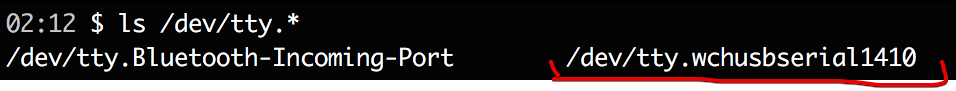
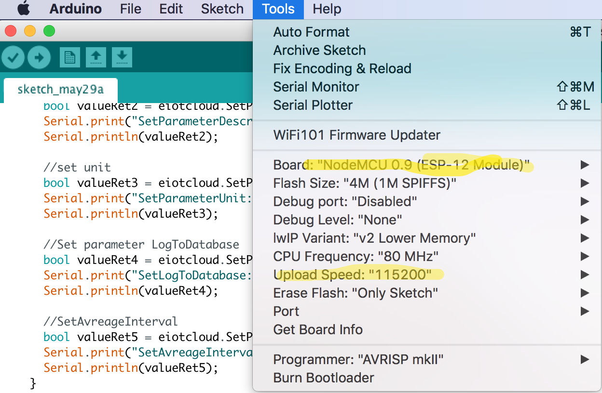
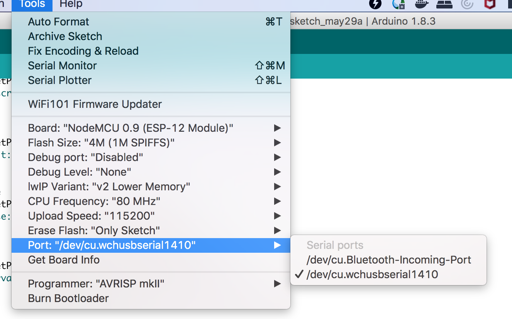

### Connecting node-mcu board to mac

1. STEPS 1-3 are optional trouble-shooting tips
2. Restart Mac
3. Press cmd + R - open terminal
4. Type csrutil disable  
5. https://github.com/nodemcu/nodemcu-devkit/wiki/Getting-Started-on-OSX 
6. https://www.instructables.com/id/How-to-Program-NodeMCU-on-Arduino-IDE
7. Install drivers https://www.silabs.com/products/development-tools/software/usb-to-uart-bridge-vcp-drivers
8. Restart Mac
9. A good quality and small nice micro usb wire is required for the mac to detect node-mcu

Confirm if the board is detected by mac:

More at:
https://github.com/nodemcu/nodemcu-devkit/wiki/Getting-Started-on-OSX

### Compiling and Uploading the program to nodemcu  

Execute get-libs.sh to get dependencies in the Arduino sketches folder.

Install ESP8266 libraries via Arduiono IDE's manage libraries menu.

### https://easyiot-cloud.com/
Its a cloud based service which uses easy-iot dashboards to display and monitor state of various IOT sensors, buttons or light-bulbs etc.
Free version has limits e.g. max 10 modules.

The rest-interface provided by easy-iot-cloud is abstracted by implementation in git repo https://github.com/iot-playground/EasyIoT-Cloud.
Just include this lib in local libraries folder of the project to use them.

Note:
The rest interface of easy-iot-cloud and easy-iot-desktop downloaded version on windows or raspberry (using mono) is absolutely different
The connection and handing of requests, plus interfacing libs are also different.

#### Login to https://easyiot-cloud.com/
generate a token and update in the code.

### Using lua vs Arduino
to use Lua we uload a firmware that runs like a JS web server and supports lua program to run. One can access this web
server after connecting to 8266's wifi and then 

ip:8080??? fix it

- one can upload programs to chip file system via ESPlorer IDE.
- ESPlorer provides access to chip file system and can be sued to debug
- is much faster to upload a small text based lua file and execute it than to compile an arduino program and rewrite the flash

Arduino libs and programs are kind of firmware in itself, that gets flashed to chip each time it is changed, compiled and uploaded.

[Download Esplorer IDE](https://esp8266.ru/esplorer/)

 

### Various links
* [instructable - quite buggy though](https://www.instructables.com/id/ESP8266-Light-Sensor/)
* [Easy IOT Documentation](https://iot-playground.com/blog/2-uncategorised/78-easyiot-cloud-rest-api-v1-0])
* [ESP8266 Arduino Core wifi Docs](http://arduino-esp8266.readthedocs.io/en/latest/esp8266wifi/readme.html)
* [get mac address of esp board](https://techtutorialsx.com/2017/04/09/esp8266-get-mac-address/)
* [220 v switch](https://iot-playground.com/blog/2-uncategorised/87-esp8266-internet-connected-switch-easyiot-cloud-mqtt-api-v1-improved)
