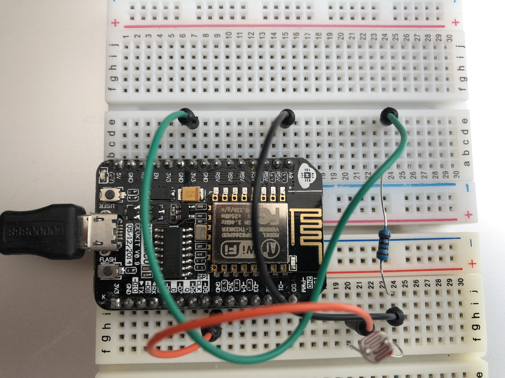

## Connection a light sensor to ESP8266 and displaying the readings easy-iot cloud 

### Setup the board


Todo: fritzing diagram

- connect node-mcu to mac
- 3.3v to a 10K resister
- resister to light-sensor & to A0 
- GND to light-sensor

### Connecting to wifi 
```cpp
    WiFi.mode(WIFI_STA);
    WiFi.begin("nereusiphone", "ajit1234");

    Serial.print("Connecting");
    while (WiFi.status() != WL_CONNECTED)
    {
    delay(500);
    Serial.print("y");
    }
    Serial.println();

    Serial.print("Connected, IP address: ");
    Serial.println(WiFi.localIP());
    Serial.print("MAC: ");
    Serial.println(WiFi.macAddress());
``` 
### Connecting to a service
 arduino's wifi client lib provided this impl to connect to any external service and later print messages to it, this is just an example.

```cpp
    WiFiClient client;
    while(!client.connect("echo.websocket.org", 80)) {
    Serial.println("connection failed..!!!");
    delay(2000);
    }*/
    Serial.println("connection success..!!!");
```
[More detailed example](https://github.com/morrissinger/ESP8266-Websocket/blob/master/examples/WebSocketClient_Demo/WebSocketClient_Demo.ino)
 
### Easy iot library used to connect to wifi and easy iot cloud
[EasyIoT-Cloud@github](https://github.com/iot-playground/EasyIoT-Cloud)

Replace constants:
#define WIFI_SSID "nereusiphone"
#define WIFI_PASS "ajit1234"
#define TOKEN "5SpmyUqPgNWGBEMS3bGI5J6rXDwAtW4FRCRZvkcN"

To start with set existingModuleId to 0 this would create a new module

```cpp
uint existingModuleId = 0; 
```

### loop()
Here we read the sensor value from analog pin A0 and push to easy iot cloud
```cpp
  sensorValue = analogRead(SENSOR_PIN);
  float level = 100 - ((sensorValue - MIN_VALUE) * 100 / (MAX_VALUE - MIN_VALUE));
  sensorValue = level;
  Serial.println("LUX = ");
  Serial.println(sensorValue);
```

```cpp
  bool valueRet = eiotcloud.SetParameterValue(parameterId, String(sensorValue));
  Serial.println("SetParameterValue: ");
  Serial.println(valueRet);
  delay(1000 * 10 * REPORT_INTERVAL);
```
